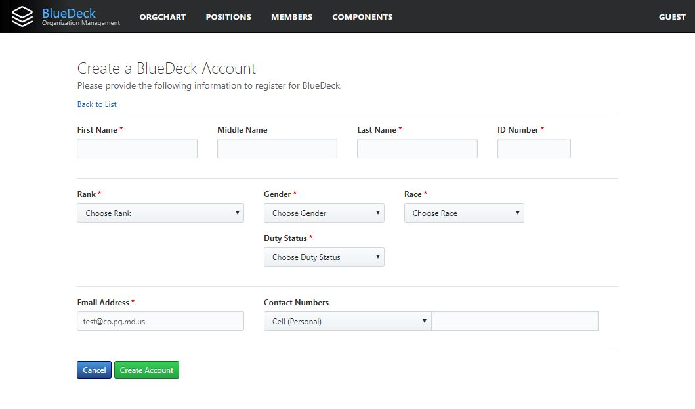

# Creating an Account

If you do not have a current BlueDeck account, then you will be directed to the "About" Page. To create an account, click the "Get an Account" button:

You will be directed to the new User Registration Form:

Most of the fields are self-explanatory. At minimum, you must provide the following required fields:

* First Name
* Last Name
* Id Number: Your Badge Number/County ID Number (e.g. 1234 or C1234... DO NOT PUT A '#')
* Rank: Select your current rank from the drop-down list. 
* Gender: Select your gender from the drop down list.
* Race: Select your race from the drop down list.
* Duty Status: Select your current duty status from the list.
* Email Address: Provide your County Email Address only. BlueDeck will pre-fill this field with it's best guess at your current email address based on your Windows Logon, but you must ensure that the email address is accurate.

In addition, you can provide these optional fields:

* Middle Name
* Contact Numbers: Although not required, we strongly recommend providing at least one contact number. You can add as many contact numbers as you like.

> If you don't see an appropriate option in one of the drop down lists in the registration form, please [Contact the BlueDeck Administrator](mailto:admin@BlueDeck.net) and ask that it be added. In the meantime, you can create an account using the next closest option, and simply change it once the field is added. 

Once you have filled out all the required fields, click the "Create Account" button. 

If your account was created successfully, you will be directed to the "Registration Pending" page:

The BlueDeck Administrator will be notified to review and fully activate your account before you can access the full suite of BlueDeck features. This will normally happen within 24 hours. While you are waiting, feel free to explore the site. Many of the features of BlueDeck, such as looking up other BlueDeck members, is available before your account is activated.

If you have any issues with or questions about creating a BlueDeck account, or you would like to check on the status of your account activation, please [Contact the BlueDeck Administrator](mailto:admin@BlueDeck.net)

