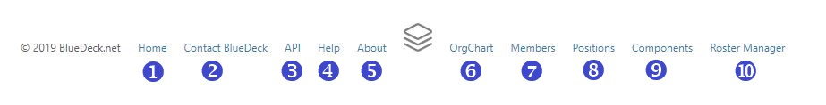

# Footer Menu

The footer menu offers quick access to additional BlueDeck resources. Depending on the status of your account, you may see some or all of the following links:

1. **Home**: this link will take you to your [Home Page](home_page.md)
2. **Contact BlueDeck**: this link will open your Email client with a blank message to the BlueDeck Administrator.
3. **API**: this link will take you to the [BlueDeck REST API Portal](rest_api.md), which contains documentation about how to connect BlueDeck data to your own project.
4. **Help**: this link will bring you to this help site.
5. **About**: this link will take you to the "About BlueDeck" page.
6. **OrgChart**: this link will take you to the [Organization Chart](orgchart.md) page, where you can view and search organization charts.
7. **Members**: this link will take you to the [Members Index](member_index.md), where you can search for and view details about the Members of your organization.
8. **Positions**: this link will take you to the [Positions Index](position_index.md), where you can search for and view details about the Positions in your organization.
9. **Components**: this link will take you to the [Components Index](component_index.md), where you can search for and view details about the Components that make up your organization.
10. **Roster Manager**: (Manager/Assistant Manager Only) this link will take you to the [Roster Manager](roster_manager.md). The Roster Manager is only available to Members who have active BlueDeck accounts and are currently assigned to a Position that is designated as the Manager/AssistantManager of an organizational Component. The Roster Manager allows Managers to manage the Positions and Members within their assigned and subordinate Components using a drag-and-drop interface.