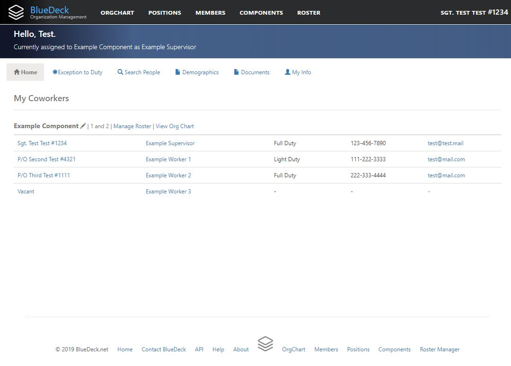
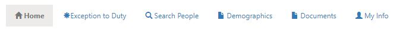
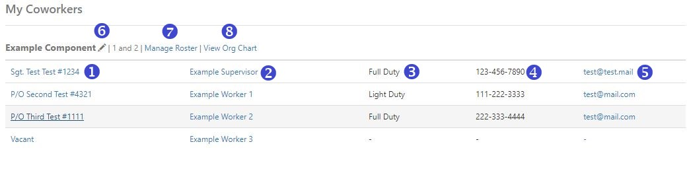
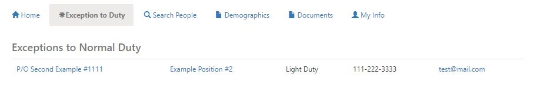
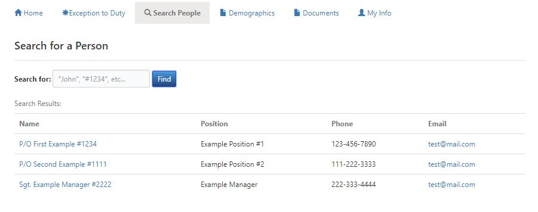
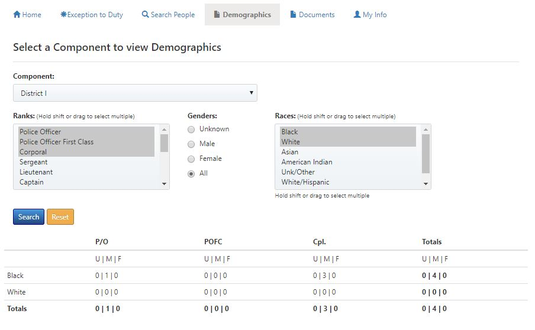
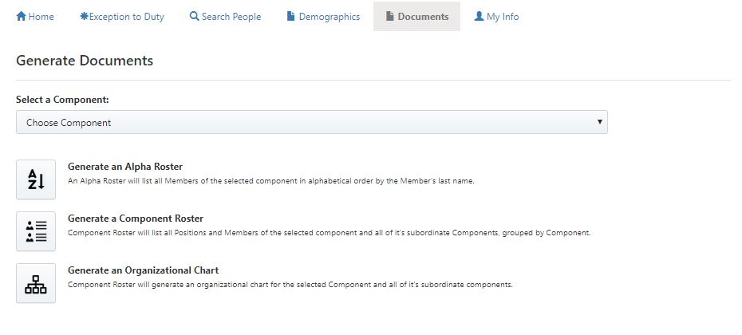
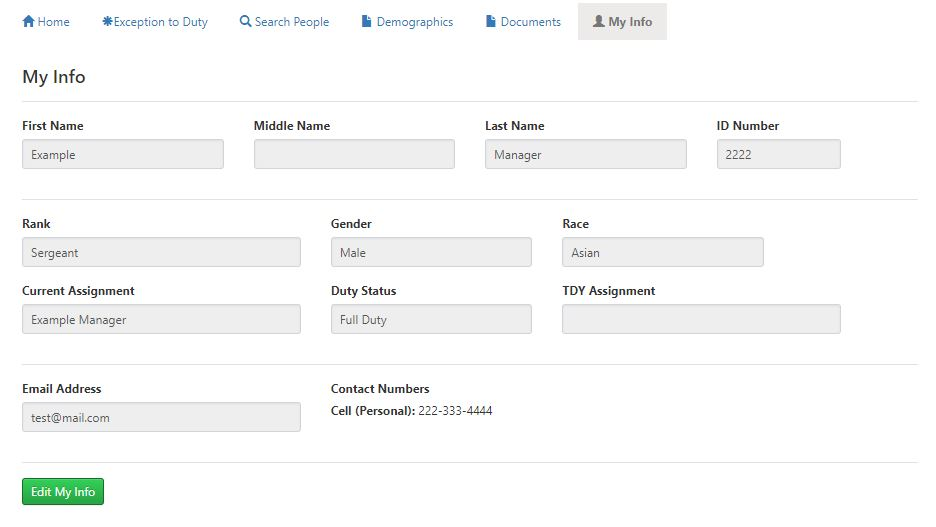

# Home Page View

### Overview
If you have an active account, you will be directed to the Home Page when you log on to BlueDeck:

### Home Page Tabs
The Home Page has several tabs that you can use to view information or access functionality:

#### My Coworkers Tab
The "Home" tab is the default. Under the "Home" tab, you will see a list titled "My Coworkers." This list will show you basic contact information for all of the organizational employees that are assigned to the same component as you are. This is intended to help you stay in touch with the people closest to you.

1. Rank/Name: You can click this link to view more detailed information about a specific coworker. If you are a Manager/Assistant Manager for your Component, this link will give you the option to edit the personal information of any other person in the Component. If there is a Position within your Component to which no person is assigned, the list will show "Vacant" in lieu of an individual's name.
2. Position Name: This is the Name of the Position in the Component to which the coworker is assigned. You can click this link to see more detailed information about a specific Position. If you are a Manager/Assistant Manager for your Component, this link will allow you to edit details about any Position within your Component.
3. Duty Status: the Coworker's currenty duty status, such as Light Duty, No Duty, Suspended, or others.
4. Contact Number: the primary contact number for a coworker. If the coworker has not provided any contact number, then you will see a "-." If you are a Manager, you can click on the coworker's name and add contact numbers for the coworker. If you want to see all contact numbers for a particular coworker, click on their name in the list.
5. Email Address: the coworker's email address. Clicking this link will open your selected Email client to a new message to this coworker.
6. Edit Component: (Manager/Assistant Only) Clicking the pencil icon will allow you to change details about the Component, such as changing the name or abbreviation.
7. Manager Roster: (Manager/Assistant Only) Clicking this link will load this Component into the [Roster Manager](roster_manager.md).
8. View Org Chart: This link will show the interactive Organizational Chart for this Component in the [OrgChart](org_chart.md).

#### Exception to Duty Tab
The Exception to Duty tab will display a list of all of the people in your Component (and all of your Component's sub-Components) that are in a Duty Status that is considered an "Exception to Normal Duty." This page is designed to quickly review the status of people in your Component that are in an alternate Duty Status. If there are no people assigned to your Component that are in an alternate Duty Status, then there will be no names in this list. The Exception to Duty list functions much like the "My Coworkers" list.

#### Search People Tab
The Search People tab allows you to quickly search for people in the entire organization. You can search by name, Id Number, or Position Name. Matching results will display in a list similar to the "My Coworkers" list:

#### Demographics Tab
The Demographics tab will allow you to view personnel demographic information broken down by Component assignment, Rank, Gender, Race, or any combination thereof. Keep in mind that when you select a Component to view it's demographics, the results will show data for the selected Component *and all of it's subordinate (child) Components*. This is designed to help Managers understand demographics for all of the organizational elements for which they are responsible.

#### Documents Tab
The Documents tab allows you to generate and download Rosters and Organizational Charts for any of the Organizational Components:

As of now, there are 3 types of Documents that BlueDeck can generate for you:
1. Alpha Roster - this will generate a Word Document roster showing all Members of the selected Component *and all of it's subordinate (child) components*. The Members will be listed in alphabetical order by Last Name.
2. Component Roster - this will generate a Word Document roster showing all of the selected Component's current Positions, Members assigned to those Positions, and all Positions and Members of the selected Component's subordinate (child) Components. The Roster will broken down by individual Components. The Component Roster is formatted similarly to the Division Rosters that are used on the Shared drive.
3. Organizational Chart - this will attempt to generate a Word Document Organization Chart for the selected Component. As of the current version of BlueDeck, the Organizational Charts that this generates are not ideal for a selected Component that Contains more than around 75 Members. A more robust version of this feature is in development.

#### My Info Tab
The My Info tab shows the information currently contained in your BlueDeck account profile. It includes an option to update your profile information. Please ensure that you keep your profile information, including contact numbers, up to date.

