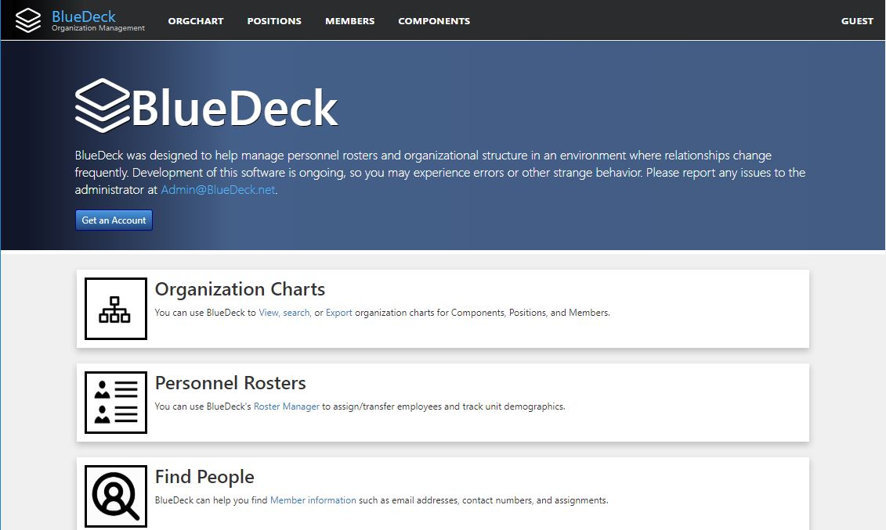

# Logging into BlueDeck

You will only be able to access BlueDeck if you have current and valid credentials to log on the organization's domain. If you are logged in to Windows on a work computer, then you have valid credentials. BlueDeck validates your identity through Windows Active Directory. BlueDeck does not know or store your password, and it will never ask you for your password.

If this is the first time you are accessing BlueDeck, you will see one of two different pages:

1. If you do not have a BlueDeck account, you will see the BlueDeck "About" Page:

 If you see this page, it means that BlueDeck does not have a pre-provisioned account for your current Window's credential. Many users will already have pre-provisioned accounts added by the site adminstrator. These pre-provisioned accounts were created based on an organizational roster in late 2018. Some users were not on this roster. If you don't have a pre-provisioned account, don't worry! Jump to the section on [Creating a new Account](create_an_account.md)

2. If you have a pre-provisioned account, you should see the BlueDeck "Pending" Page:

If you see this page, your account has already been created. A BlueDeck administrator will activate your account shortly. 
You do not need to wait for your account to be activated to use many of the features of BlueDeck. You can view organizational charts and use the [Members Index](member_index.md), [Positions Index](position_index.md), or [Components Index](component_index.md) to look up information about your organization. 

