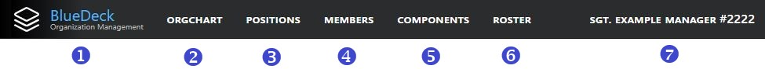

# Navigation Bar
The main navigation bar is displayed at the top of the page and allows you to quickly navigate to the different sections of BlueDeck:

Depending on your account status, the navigation bar will show the following links:
1. **BlueDeck Logo/Title**: Clicking the BlueDeck Logo or Title will show the "About BlueDeck" page.
2. **OrgChart**: this link will take you to the [Organization Chart](orgchart.md) page, where you can view and search organization charts.
3. **Positions**: this link will take you to the [Positions Index](position_index.md), where you can search for and view details about the Positions in your organization.
4. **Members**: this link will take you to the [Members Index](member_index.md), where you can search for and view details about the Members of your organization.
5. **Components**: this link will take you to the [Components Index](component_index.md), where you can search for and view details about the Components that make up your organization.
6. **Roster**: (Manager/Assistant Manager Only) this link will take you to the [Roster Manager](roster_manager.md). The Roster Manager is only available to Members who have active BlueDeck accounts and are currently assigned to a Position that is designated as the Manager/AssistantManager of an organizational Component. The Roster Manager allows Managers to manage the Positions and Members within their assigned and subordinate Components using a drag-and-drop interface.
7. **Member Name**: clicking on your name will take you to your [Home Page](home_page.md)